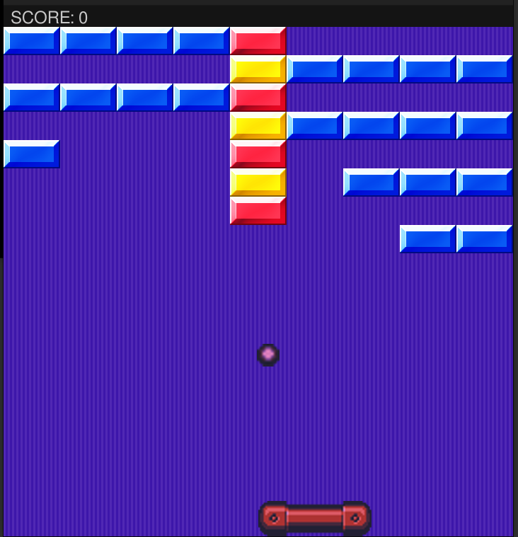

# Arkanoid  
  
## Todo:  
---Implement first power up
  
## Improve code:  
---Implement an object interaction manager (block collisions, freeze/endgame, powerup,ball collision) 
---Implement and extensible level management,blocks generators etc     
---Implement hitboxes on sides/corners for the ball(!!!!)   




Install requirements and run 

    python3 arkanoid.py

if you have any problem with requirements, just manually install ```pillow```, ```numpy``` and ```pygame```.


